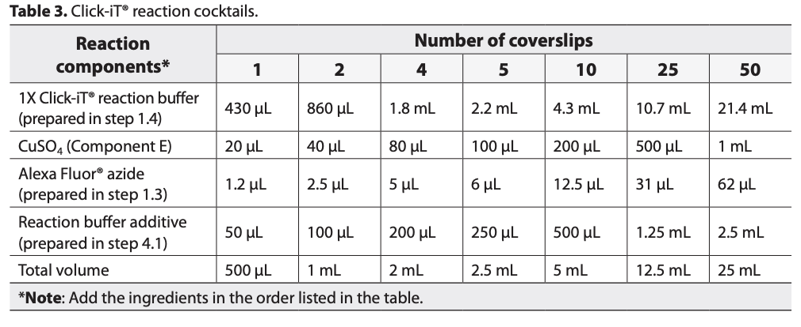

<link href="/styles.css" rel="stylesheet">
Updated: Aug 12, 2024

Adapted from the Click-iT EdU Imaging Kit protocol ([C10340](https://www.thermofisher.com/order/catalog/product/C10340); [Manual](https://www.thermofisher.com/document-connect/document-connect.html?url=https://assets.thermofisher.com/TFS-Assets%2FLSG%2Fmanuals%2Fmp10338.pdf))

Clearing adapted from DOI: 10.1126/sciadv.aba0365

## Table of Contents
- [Table of Contents](#table-of-contents)
- [Setup](#setup)
  - [Prepare Stock Solutions](#prepare-stock-solutions)
    - [PBS-T (1%)](#pbs-t-1)
    - [4% BSA in PBS](#4-bsa-in-pbs)
    - [F-ara-EdU (20mM stock in DMSO)](#F-ara-edu-20mm-stock-in-dmso)
    - [Alexa Fluor 647 azide (Component B)](#alexa-fluor-647-azide-component-b)
    - [Click-iT reaction buffer (Component D)](#click-it-reaction-buffer-component-d)
    - [Click-iT buffer additive (Component F)](#click-it-buffer-additive-component-f)
  - [Materials](#materials)
  - [Buffers](#buffers)
- [Protocol](#protocol)
  - [1. F-ara-EdU Pulse Labeling](#1-F-ara-edu-pulse-labeling)
  - [2. Fixation \& Permeabilization](#2-fixation--permeabilization)
  - [3. Blocking](#3-blocking)
  - [4. Click-iT F-ara-EdU Fluorescent Labeling and Detection](#4-click-it-F-ara-edu-fluorescent-labeling-and-detection)
    - [For 250µl reactions:](#for-250µl-reactions)
  - [5. Staining DNA](#5-staining-dna)
  - [6. Mounting and Imaging](#6-mounting-and-imaging)
- [Notes/Ideas for Future Tweaking:](#notesideas-for-future-tweaking)
- [Experiments](#experiments)
  - [F-ara-EdU short chase](#F-ara-edu-short-chase)
  - [± chorion](#-chorion)
    - [Question: Does the chorion affect EdU incorporation?](#question-does-the-chorion-affect-edu-incorporation)

## Setup

### Prepare Stock Solutions

#### PBS-T (1%)
|Reagent	| Quantity (for 500 mL)	| Final concentration
|------------|---------------------|---------------------|
|PBS 1X | 495mL | - |
|Tween-20 | 5mL | 1% |

#### 4% BSA in PBS
- Dissolve 2g of BSA in 50mL of PBS.

#### High salt PBS (for better DAPI penetration)
|Reagent	| Quantity (for 500 mL)	| Final concentration
|------------|---------------------|---------------------|
|NaCl | 1.06g | 500 mM (363mM added to 137mM in std PBS)|
|PBS 1x | to 50 mL||

#### F-ara-EdU (20mM stock in DMSO)
- F-ara-EdU (2′S)-2′-Deoxy-2′-fluoro-5-ethynyluridine, (Sigma #T511293; FW 270.22 g/mol)
  - *Note: technically, given the formula weight, this is an 18.5mM stock...*
  - Add 1 ml of DMSO or PBS to vial containing 5 mg F-ara-EdU to make a 20 mM stock solution. 
  - After being dissolved, remaining F-ara-EdU stock solution is stable for up to 1 year when stored at −20 °C. 
  - F-ara-EdU solution should be portioned into single use aliquots to avoid freeze thawing. 
  - CAUTION: EdU is incorporated into DNA and is a potential mutagen. Proper protective clothing should be used when handling EdU. Waste, including stock solutions, used substrate, and water containing F-ara-EdU should be considered as hazardous.

### Click-It stocks

#### Alexa Fluor 647 azide (Component B)
1. Prepare a master stock solution of the Alexa Fluor® azide (Component B): Add 70 µL of DMSO (Component C) to Component B, then mix well. 
  - After use, store any remaining working solution at ≤–20°C. When stored as directed, this working solution is stable for up to 1 year.
2. Prepare a _Dye Working Stock_ by diluting the master stock 1:100 in DMSO (assuming that the final concentration for the master stock from the kit is 5uM)

#### Click-iT reaction buffer (Component D)
- Prepare a working solution of 1X Click-iT® EdU reaction buffer (Component D):
  - Transfer the solution (4 mL) in the Component D bottle to 36 mL of deionized water.
  - To make smaller amounts of 1X Click-iT® EdU reaction buffer, dilute volumes from the Component D bottle 1:10 with deionized water. After use, store any remaining 1X solution at 2–8˚C. When stored as directed, this 1X solution is stable for 6 months.

#### Click-iT buffer additive (Component F)
- To make a 10X stock solution of the Click-iT® EdU buffer additive (Component F): Add
    - 2 mL deionized water to the vial, then mix until fully dissolved. 
- After use, store any remaining stock solution at ≤–20˚C.
- When stored as directed, this stock solution is stable for up to 1 year.
- If the solution develops a brown color, it has degraded and should be discarded.

### Custom Click stocks

#### Azide Dye Stock
- picolyl-Azide-Dye: 4 mM in H2O (3 mg in 1 ml H2O) (final 8 µM)

#### Copper Sulfate Stock (CuSO$_4$.5H$_2$O; MW 249.68)
- Dissolve 250 mg CuSO$_4$.5H$_2$O in 5 ml H$_2$O for 200mM working stock
- Final concentration in reaction: 2mM

#### Sodium Ascorbate Working Stock (Buffer additive, NaC$_6$H$_7$O$_6$; MW 198.11)
- **NOTE: Make Fresh for each experiment**
- Dissolve 0.198 g in 1 mL $H_2O$ for 100mM working stock
- Final concentration in reaction: 10 mM

### Clearing stocks

#### Detergent Mix (1 L)
|Reagent	| Quantity (for 500 mL)	| Final concentration
|------------|---------------------|---------------------|
|10% SDS| 100mL | 1% |
- 1% SDS: 100 mL 10% SDS (may be filtered)
- 0.5% Deoxycholate: 5g Deoxycholate (wear a mask when handling the powder)
50 mM Tris-HCl (pH 7.5): 50 mL 1 M Tris-HCl (pH 8.0)
1 mM EDTA (pH 8.0): 2 mL 0.5 M EDTA (pH 8.0)
150 mM NaCl: 30 mL 5 M NaCl

#### Clearing Solution-1.1
- 8 to 10% (v/v) THEED (Sigma-Aldrich, 87600-100ML)
- 5% (v/v) Triton X-100 (Roth, 3051.2), and 
- 5% (w/v) urea (Roth, X999.2) in dH2O
  
### Materials
- 1.5 ml Microcentrifuge tubes (clear)
- Rocker
- Staining vials
- Click-iT EdU Alexa Fluor 647 Imaging Kit (ThermoFisher #C10340)

## Protocol
### 1. F-ara-EdU Pulse Labeling
1. Collect embryos at the desired stage.
2. Dechorionate embryos in Filtered Natural Sea Water or ASW. 
     - TODO: Test whether dechorionation is necessary.  If not, will permit more pulse and longer chases throughout development.
3. Transfer embryos or larvae into 1.5 ml microcentrifuge tube or multi-well plate (e.g. 24-well plate) depending on desired pulse length. 
   - If using a plate, you should pre-coat with 0.2% agarose to prevent embryos from sticking and allow for chorion expansion.
4. To optimize labeling efficiency and minimize toxicity, you should set up a test matrix of different concentrations and durations of F-ara-EdU labeling.
   - Include cultures treated with vehicle alone for controls.

    | | 30 min | 60 min | 120 min | 24 h |
    |---|---|---|---|---|
    |1µM| | | | |
    |10µM| | | | |
    |100µM| | | | |
    |0µM (no EdU control)| |x |x |x |

5. Add appropriate volume of F-ara-EdU (20mM stock) to achieve desired final concentration.
   - For example, to achieve a final concentration of 10µM, add 1µl of 20mM F-ara-EdU stock solution to 2ml of FNSW.
6. Incubate embryos in F-ara-EdU solution at 18°C for desired time interval.
7. If chasing, change back into FNSF + 1% Pen/Strep after pulse for duration of chase interval.
   - Transfer to a clean plate or tube to avoid carryover of f-ara-EdU (e.g. in agarose).
8. Proceed immediately to fixation and permeabilization (below).

### 2. Fixation & Permeabilization
1. Fix embryos overnight in 4% PFA in FNSW at 4°C in round bottom 2mL tubes.
    - Alternatively, you ***may*** fix embroys for ~1h at RT in 4% PFA in FNSW but O/N is better.
    - Can be left for up to 4 days?
2. After fixation, remove fixation buffer and wash embryos in 1mL PBS-T (1%) on rocker.
  - 1x 5 min
  - 2x 10 min
3. Proceed to next step.

### 3. Target Retrieval
1. Remove PBS-T and add 1mL of prechilled acetone (-20ºC) to each tube.
2. Keep at -20ºC for a minimum of 2h.
3. Wash 3x with 1mL PBS-T (1%) for 5-10 min each.
4. OPTIONAL (not recommended in _conjunction_ with detergent below) Add 500µl of proteinase K (75 µg/mL; Merck 1245680100) and rock for 5 min at RT.
     - Quench with 2x exchanges of 1mL glycine (2mg/mL)
5. **PREFERRED Wash 3x with 1mL [Detergent mix](#detergent-mix-1-l) for 20-30 min each at RT.**
6. Wash 3x with 1mL PBS-T (1%) for 5-10 min each.

### 4. Blocking
1. Block embryos in 1mL 4% BSA in PBS for 1h at RT on rocker.
2. Wash embryos in 1mL 4% BSA in PBS 1 x 5 min on rocker.
3. Proceed to next step.
   
PAUSE POINT: Store at 4ºC

### 5. Click-iT F-ara-EdU Fluorescent Labeling and Detection
1. Allow Click-iT kit components to come to room temperature before opening.
2. Prepare ***1X Click-iT® EdU buffer additive*** (Component F) by diluting the 10X stock solution 1:10 in deionized water. Prepare this solution fresh and use the solution on the same day.
3. Prepare ***Click-iT® reaction cocktail*** according to Table. It is important to add the ingredients in the order listed in the table; otherwise, the reaction will not proceed optimally. Use the Click-iT® reaction cocktail within 15 minutes of preparation. 
 - For each tube mix together: 
   - ***430 μl of 1x Click-iT reaction buffer***
   - ***20 μl CuSO4***   (Component E) 
   - ***1.2 μl fluorescent azide*** (Component B)
   - ***50 μl 1x reaction buffer additive*** (Component F; diluted above from 10x stock). 
 - Scale up the mixture for the number of samples to be treated and add 500 μl to each tube. 
 - It is important to use the cocktail within 15 min of preparation. 
 - It is good practice to include a control sample of cells not exposed to EdU. In addition, these cells are needed for single staining compensation controls for intracellular antigens or antigens stained with RPE, PE-tandem, or Qdot antibody conjugates.
  
  
### 5. ALTERNATE Custom Click Rxn Table

  | Reaction Components / Reaction| 1| 2 | 4 | 5 | 10 | 25 | 50|
  |---|---|---|---|---|---|---|---|
  | 1x PBS | 394 µl | x µl | x µl | x ml | x ml | x ml | x ml |
  | CuSO4 (200 mM) | 5 µl | x µl | x µl | x µl | x µl | x µl | x µl |
  | Fluorescent azide (4 mM) | 1 µl | x µl | x µl | x µl | x µl | x µl | x µl |
  | DMSO | 50 µl | x µl | x µl | x µl | x µl | x µl | x ml |
  | Sodium Ascorbate (100 mM; Fresh) | 50 µl | x µl | x µl | x µl | x µl | x µl | x ml |
  | Total volume | 500 µl | x µl | x ml | x ml | x ml | x ml | x ml |

\* Add reagents in the order listed above. Use within 15 min of preparation.

\* DMSO protects the DNA from free radicals generated by the Cu(I) catalyst.

\* For lower dye concentrations, you can try 10 µl of 10µM dye in 500 µl reaction for a final conc. of 200nM.
1. Remove the blocking buffer.
2. Quick wash each sample *twice* with 1 mL of PBS. Remove the wash solution.
3. Add 0.5 mL of Click reaction cocktail to each tube. place on rocker.
4. Incubate for 30-60 minutes at room temperature, protected from light (longer gets deeper in hatchlings).
5. Remove the reaction cocktail and wash twice with 1 mL of 4% BSA in PBS.
6. Optional: Keep overnight in 4% BSA in PBS at 4ºC to allow excess dye to diffuse out of yolk.

### 6. Staining DNA
1. Add 1µl of 1000X DAPI (**TODO: Need concentration**) to each tube. 
   - For better/faster penetrance, change tube to [high-salt PBS](#high-salt-pbs-for-better-dapi-penetration) when staining.
2. Stain for 30-60 min at RT on rocker. (or O/N at 4ºC).
3. Remove DAPI and wash once with 1 mL of PBS w/ 4% BSA. 
4. Final wash in 1x PBS
5. Store at 4ºC until imaging.

### 7. Clearing (Optional)
1. Transfer embryos to glass vial containing 10mL of Clearing Solution-1.1
   - Gently rock for 3-6 hours at 37ºC
2.  Transfer back to 2mL round bottom tubes and wash 3x with 1mL PBS-T (1%) for 5-10 min each.

### 8. Mounting and Imaging
1. Mount on Matex in 1% agarose in Vectashield for RI matching (or Fluoromount-G but does not match as well).
2. Image on confocal microscope.

## Notes/Ideas for Future Tweaking:
- Background in yolk significantly reduced with pre-block with BSA.
  - May also try casein (milk) for blocking too. or LMW-Dextran.
-  A few suggestions for optimizing:
  - Can we reduce the amount of fluorescent dye?
  - Longer washes after Click (trying ON soak in PBS currently)

- Probably need to consider:
  - Increasing the dose >100µM for shorter pulses
    - Need to read up on what is usual dosing for EdU in other systems (e.g. zebrafish embryos; 400 μM EdU for 1 h at room temperature?)
  - Increasing the pulse time (1 hour is not really labeling much, and 24 hours seems good, but maybe because some cells are cycling twice?)

# Experiments

### F-ara-EdU short chase
- Pulse St20 embryos for 1 hr with 100µM F-ara-Edu
  - 5mL FNSW required per dish
    - 25µl 20mM F-ara-EdU per 5mL FNSW
- change back into FNSF + 1% Pen/Strep after pulse
  - Reserve some 0hr chase embryos for comparison
- Collect after:
  - 0h
  - 1h
  - 2h
  - 4h
  - 8h
  - 12h
  - 24h
  
  #### Results
  - Need to wash embryos more thoroughly after Click Rxn
  - May need higher dose (400µM?) and/or longer pulse for better labeling

### ± chorion
#### Question: Does the chorion affect EdU incorporation?
- Pulsed St26 embryos ± chorion in 50µM F-ara-Edu (12.5µl per 5ml FNSF) for:
  - 1h
  - 24h
- Blocked for 1h
- Only used 250µl Click Rxn 
- Result for 1 hr is very weak/low staining with moderately high background:
  - likely because of less proliferation at later stage, short pulse, and/or accessibility
- Need to assess the 24 hr pulse as well
  - 24 hour pulse click Rxn performed in 500 mL reaction
  - 24 hour pulse much stronger and cleaner

#### Results
- Lower levels of F-ara-EdU incorporation in embryos with chorion
- Interesting structures observed on anterior side.

## Suggestions from the Lab
- Bring dye conentration down to ~50nM (vs 5µM final in standard ClickIt kit)
  - Azdye 647 - azide plus (Click chemistry tools)
  - 50nM 
  - On ice, one minute
  - Get Richard's protocol for EdU-click
    - 1 mM CuSO4
    - 200 nM AzPlus-dye in PBS-T w/ 10% DMSO (This is 2 orders of magnitude lower than the Alexa647 in the ClickIt kit)
    - 5 mM sodium ascorbate
  - Stocks:
    - 100mM CuSO4
    - 100mM sodium Ascorbate

